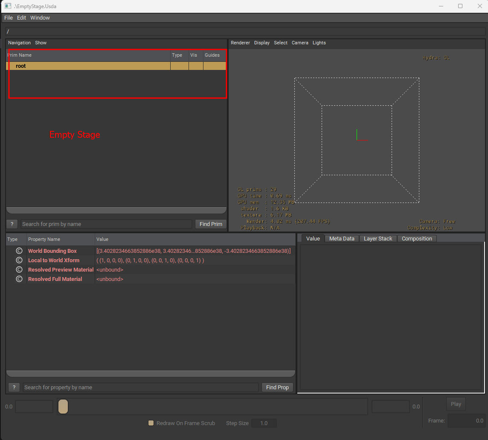

# Over
Stage is the entry point is USD. The way stage in real life is the platform for the artits to perform, in USD, stage is the platform where all the magic happens

## Python code for creating an empty stage
```python 
from pxr import Usd
stage = Usd.Stage.CreateNew("EmptyStage.Usda")
stage.Save()
```
## Generated USD file
```
#usda 1.0

```

```admonish info 
Notice the empty usd file created
```


## View of the generated USD file



```admonish note 
An empty usd stage comes with a `root` layer
```
